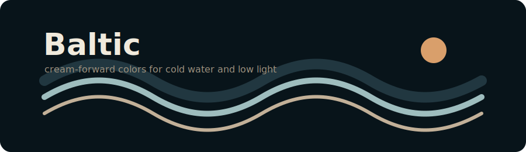
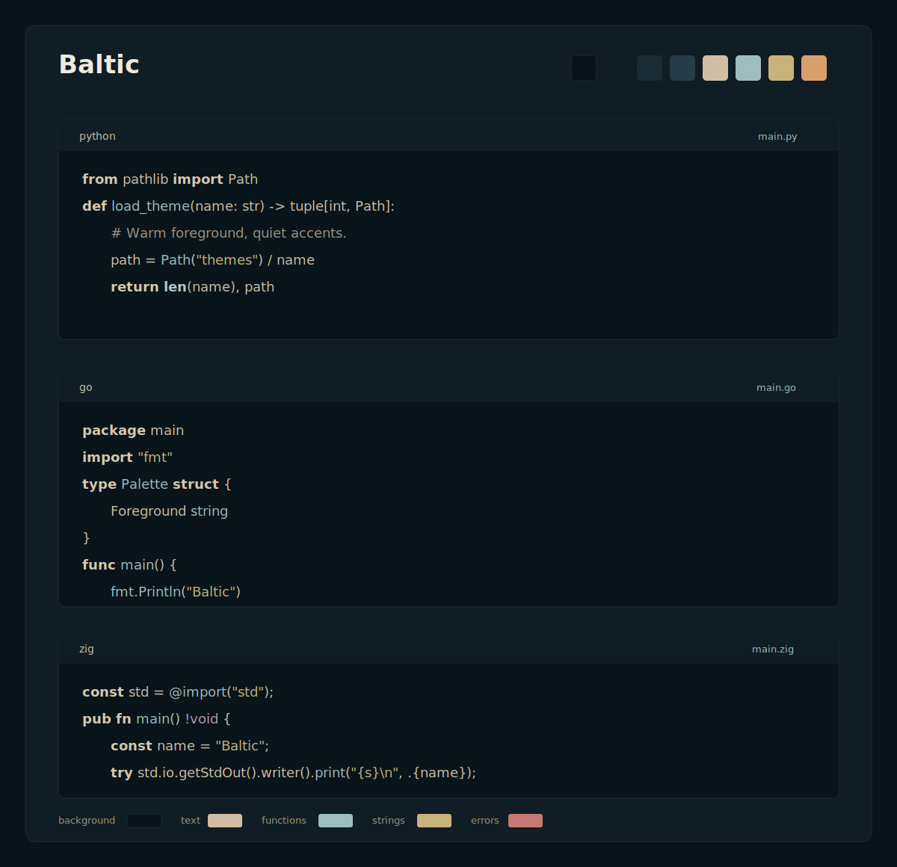

# Baltic

<p align="center">
  
</p>

<p align="center">
  <strong>Cream text, deep blue-black surfaces, and quiet coastal accents.</strong>
</p>

<p align="center">
  
</p>

Baltic is a cream-forward dark theme for editors and terminals. It keeps the main text warm and readable, then uses a small set of cold, muted accents for code structure.

The palette is not a clone of Naysayer or Solarized. It follows the same kind of restraint: stable contrast, few loud colors, and syntax colors that stay useful after long sessions.

## Palette

| Role | Hex | Use |
| --- | --- | --- |
| Background | `#08141a` | editor and terminal base |
| Surface | `#101d24` | panels, status bars, inactive lines |
| Surface high | `#1a2b33` | borders, tabs, hover states |
| Selection | `#263d47` | selected text and active UI |
| Text | `#d1bda3` | default foreground |
| Bright text | `#f0eadc` | headings and active foreground |
| Muted text | `#9f927f` | comments and secondary UI |
| Keyword cream | `#d8c8ad` | keywords and control flow |
| Baltic silver | `#9ebdbe` | functions, types, active accents |
| Pale silver | `#b8c9c8` | builtins and special variables |
| Reed gold | `#c9b27a` | strings and modified state |
| Harbor amber | `#d99f6b` | cursor, warnings, prompt accents |
| Dusk mauve | `#b79ab2` | constants and numbers |
| Pine | `#97b88b` | success and created state |
| Clay red | `#c57972` | errors and deletion |

## Supported Editors

| App | Package |
| --- | --- |
| VS Code | `vscode/` |
| Zed | `zed/` |
| Neovim | `nvim/` |
| Helix | `helix/` |
| Ghostty | `ghostty/` |

## Install

### VS Code

```sh
cd vscode
npm install
npm run package
code --install-extension baltic-theme-0.1.0.vsix
```

Then choose `Baltic` from the color theme picker.

### Zed

Use `zed/` as a development extension directory, or copy `zed/themes/baltic.json` into your Zed themes directory.

```json
{
  "theme": {
    "mode": "dark",
    "dark": "Baltic"
  }
}
```

### Neovim

Install the repository with your plugin manager and enable the colorscheme:

```vim
:colorscheme baltic
```

With `lazy.nvim`:

```lua
{
  "mlschodkowski/baltic",
  name = "baltic.nvim",
  priority = 1000,
  config = function()
    vim.cmd.colorscheme("baltic")
  end,
}
```

### Helix

```sh
mkdir -p ~/.config/helix/themes
cp helix/baltic.toml ~/.config/helix/themes/baltic.toml
```

Then set:

```toml
theme = "baltic"
```

### Ghostty

```sh
mkdir -p ~/.config/ghostty/themes
cp ghostty/Baltic ~/.config/ghostty/themes/Baltic
```

Then set:

```ini
theme = Baltic
```

## Repository Layout

```text
.
├── ghostty/          Ghostty terminal theme
├── helix/            Helix editor theme
├── nvim/             Neovim package mirror
├── vscode/           VS Code extension package
├── zed/              Zed extension package
├── colors/           Neovim root plugin entry
├── lua/              Neovim root plugin module
├── docs/assets/      README preview assets
└── palette.md        Shared palette notes
```

## Design Notes

Baltic uses cream as the normal reading color, not as a rare highlight. Keywords stay close to the text color, so the editor does not become a rainbow of control flow. Function and type names use a muted silver-blue accent, which separates calls from definitions without fighting the warm foreground.

The background is deep blue-black rather than pure black. This gives the cream text room to breathe while keeping panels, tabs, and selections visible with small contrast changes.

## Validation

The theme files are intentionally plain data and Lua:

```sh
python3 -m json.tool vscode/package.json
python3 -m json.tool vscode/themes/baltic-color-theme.json
python3 -m json.tool zed/themes/baltic.json
luac -p nvim/colors/baltic.lua nvim/lua/baltic/init.lua nvim/lua/baltic/palette.lua
xmllint --noout docs/assets/baltic-preview.svg
```

The VS Code package follows the official theme contribution shape, the Zed theme declares the official `v0.2.0` schema, and the Neovim theme is implemented with `nvim_set_hl`.

## License

AGPL-3.0
